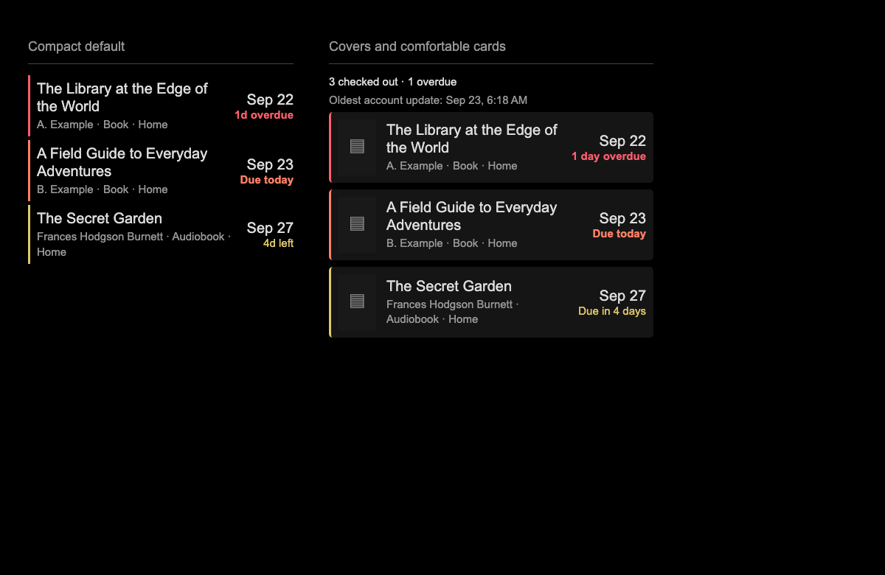

# MMM-CARL

[](https://github.com/exula/MMM-CARL/actions/workflows/ci.yml)

Compact household library loans for MagicMirror², using the CatalogPlus JSON endpoints at `catalogplus.libraryweb.org`. Each account has its own server-side cookie jar. Enter each account’s card and password (or last name for surname-based login) directly in the module’s MagicMirror `config.js` settings. No environment variables are required.



*Rendered with synthetic loan data; the cover-card preview shows missing-image placeholders.*

- Household accounts sorted by due date, with today/overdue highlighting.
- Optional covers, metadata, account groups and configurable sizing.
- Hourly polling, separate account sessions and saved results during outages.
- Optional alternation with another module in the same display region.

## Services and credentials

The module uses the library's [CatalogPlus JSON service](https://catalogplus.libraryweb.org/) and optionally [TLC's cover-content service](https://ls2content.tlcdelivers.com/). A valid library card and password/PIN or surname are required. Users do not need a separate developer API key for the verified library. The cover `customerID` identifies the library's content-service configuration, not the patron. These are unofficial catalog endpoints and can change.

## Will my library work?

**Verified:** `catalogplus.libraryweb.org`, with surname-based login, live loan retrieval, session reuse, offset pagination and cover-image requests.

**Supported in configuration, but not live-verified elsewhere:** other TLC LS2 PAC/CatalogPlus catalogs that expose the same login and loan JSON endpoints. Set `catalogUrl` to that catalog's HTTPS address. Password/PIN login sends the exact password you configure; the surname fallback continues working for existing users.

**Not a universal library connector:** the CARL name does not guarantee compatibility with every CARL installation. Other catalog products, SSO/MFA/CAPTCHA logins, or different endpoint/payload formats are not supported. Verify with the standalone checker before adding the module to your display. Other libraries may need their own `configName`, cover `customerID`, `contentServerAddress`, and `timeZone`.

## Installation

MMM-CARL runs inside an existing [MagicMirror² installation](https://docs.magicmirror.builders/getting-started/installation.html). It is not a standalone application. Use a Node.js version supported by your MagicMirror release; this module requires **Node.js 20.19 or newer**. No separate build or npm start command is needed for the module.

Run these commands on the machine running MagicMirror (adjust `~/MagicMirror` if installed elsewhere):

```sh
cd ~/MagicMirror/modules
git clone https://github.com/exula/MMM-CARL.git
cd MMM-CARL
npm ci
```

`npm ci` installs the versions in `package-lock.json`. Run it in the module directory, not the MagicMirror root. The included `pnpm-lock.yaml` is optional for contributors using pnpm; npm is the documented installation path.

## Configuration

Add this entry to the `modules` array in your MagicMirror `config/config.js`. Replace the placeholders, then restart MagicMirror. Keep the directory and module name exactly `MMM-CARL`:

```js
{
  module: "MMM-CARL",
  position: "top_right",
  header: "Library loans",
  config: {
    accounts: [
      { name: "My library", card: "YOUR_LIBRARY_CARD", password: "YOUR_PASSWORD_OR_PIN" }
    ]
  }
}
```

For surname-based login, replace `password` with `lastName: "YOUR_LAST_NAME"`. If the catalog requires both a surname and a separate password, supply both. An explicit password takes precedence and is sent exactly as entered (including spaces); quote numeric PINs and card numbers to preserve leading zeros. Existing surname-only configurations need no changes.

`config.example.js` provides a copyable sample with optional covers. The full option reference below is optional: compact due-date sorting and hourly polling work without appearance settings.

## Check the connection

After saving your MagicMirror configuration, run this from `MagicMirror/modules/MMM-CARL`:

```sh
npm run check
```

For a custom configuration path:

```sh
npm run check -- /absolute/path/to/config.js
```

This executable check logs in, retrieves loans, and checks session reuse without starting the display. It reports account indices and loan counts, returning a nonzero exit code if any account fails. Debug mode adds sanitized diagnostics. It never renews or modifies loans and does not print credentials, titles, response bodies or cookies.

The checker uses the first enabled `MMM-CARL` entry in a full MagicMirror configuration. It also accepts a CommonJS file exporting just `{ accounts: [...] }`. `config.example.js` contains placeholders; replace them locally before using it for a connection check.

## Updating

On the MagicMirror machine:

```sh
cd ~/MagicMirror/modules/MMM-CARL
git pull --ff-only
npm ci
```

Restart MagicMirror using your normal launch method and reload any separate browser clients. Configuration belongs in MagicMirror's `config/config.js`, outside this module's repository, so module updates preserve account settings. If Git reports local edits, review those changes before updating.

## Multiple accounts

For a household, add accounts to the same module entry. This example uses surname-based login and explicitly shows some default display settings. Restart MagicMirror after changing accounts.

```js
{
  module: "MMM-CARL",
  position: "top_right",
  header: "Library loans",
  config: {
    accounts: [
      { name: "Home", card: "<library-card>", lastName: "<last-name>" },
      { name: "Second account", card: "<second-card>", lastName: "<last-name>" }
    ],
    pollSeconds: 3600,
    showAccount: true,
    groupByAccount: false,
    showAuthor: true,
    showFormat: true,
    maxItems: 10,
    soonDays: 7,
    warningDays: 3,
    timeZone: "America/New_York",
    locale: "en-US"
  }
}
```

Use one account entry or up to 20. Keep card numbers in quotes to preserve leading zeros. `name` is an optional display label; `card` plus either `password` or `lastName` are required strings. `lastName` is omitted from the login payload when not configured.

Default polling is hourly. Set `pollSeconds` to change it (300–86400 seconds). Polls run after the previous poll finishes, with no overlap. All display instances share the first configured household and a single poller; use the same accounts and polling settings in each instance. Repeated subscriptions do not force extra logins.

## Catalog settings

| Option | Default | Purpose |
| --- | --- | --- |
| `catalogUrl` | `"https://catalogplus.libraryweb.org"` | HTTPS catalog base URL, optionally with a path such as `/ls2pac`. No login/query URL. |
| `configName` | `"default"` | Value for the catalog's `Ls2pac-config-name` header. |
| `pollSeconds` | `3600` | Server polling, 300–86400 seconds. |
| `customerID` | `"009787"` | Library's TLC cover-service customer, not a patron ID. |
| `contentServerAddress` | `"https://ls2content.tlcdelivers.com"` | Cover-service address. |

Catalog and cover settings are independent. Changing `catalogUrl` does not automatically discover cover settings. All accounts in one mirror use the same catalog; separate libraries with different endpoints in the same running mirror are not currently supported. Multiple display instances share the first instance's account/catalog/polling settings.

### Troubleshooting setup

- **Configuration error:** the screen/checker names the missing setting or account index without printing its value. Keep cards and passwords quoted.
- **Login failed:** first try the same card and password on the library website. For surname login use `lastName`; for a PIN use `password`. If web login works, check whether the catalog uses a different API or login flow.
- **No cover:** enable `showCovers`, check the library's cover customer/server settings, and confirm the record has UPC/ISBN identifiers. Missing covers use placeholders.
- **Nothing listed:** check `filter`, `accountNames`, `hideWhenEmpty`, and any account error. `browser.data` debug counts distinguish empty results from failures and pending requests.
- **Stale items:** the account's last successful list stays visible when the library is temporarily unreachable. The module retries on its next scheduled poll.

## Display defaults

- Default view sorts all household loans globally by due date, unknown dates last.
- `maxItems` limits the earliest items shown; `0` shows everything. A footer counts remaining items.
- `groupByAccount: true` groups the globally selected items by account. Groups follow their first item in the selected sort order; items within each group remain sorted. Grouping necessarily replaces strict global row order.
- `showAccount: false` hides account labels, including in error messages. `showAuthor` and `showFormat` toggle metadata.
- Dates and days remaining use the configured time zone and calendar days, handling daylight saving changes. The display refreshes every minute even between polls.
- CSS states: `catalogplus-normal`, `catalogplus-soon` (4–7 days), `catalogplus-warning` (1–3 days), `catalogplus-due-today`, and `catalogplus-overdue`. Thresholds are configurable; keep `warningDays <= soonDays`.
- Unknown epoch dates use `dueDateString` as display-only fallback, with no guessed countdown. Missing metadata is omitted.
- On account failures, the last successful loans remain visible with dashed borders and an account error showing the saved date. Other accounts continue updating. An empty result is distinguished from a failed or still-loading result.

## Display options

All options go inside the module's `config`. Defaults preserve the compact, text-only display. Each display instance can choose its own appearance and filters.

| Option | Default | Behavior |
| --- | --- | --- |
| `showAccount` | `true` | Show the account label beside each loan or as a group heading. |
| `groupByAccount` | `false` | Group selected rows by account instead of strict global order. |
| `showAuthor` / `showFormat` | `true` / `true` | Toggle author and format metadata. |
| `maxItems` | `10` | Maximum matching loans shown; `0` shows all. |
| `soonDays` / `warningDays` | `7` / `3` | Countdown thresholds; keep warning at or below soon. |
| `locale` | `"en-US"` | Date formatting and text sorting locale. |
| `timeZone` | `"America/New_York"` | Time zone for due dates and calendar-day countdowns. Change for your library. |
| `animationSpeed` | `300` | Content-update animation duration in milliseconds. |
| `width` | `"360px"` | Number of pixels or CSS length (`px`, `rem`, `em`, `%`, `vw`, `vh`); `auto` also works. |
| `maxHeight` | `"none"` | Optional height limit with manual vertical scrolling. No automatic scrolling. |
| `density` | `"compact"` | `compact`, `comfortable`, or `spacious`. |
| `rowGap` / `rowPadding` | `null` | Override density's row gap / vertical padding; numbers are pixels. |
| `fontScale` | `1` | Text scaling from 0.5 to 2, scoped to this module. |
| `layout` | `"list"` | `list` or `cards` (stacked rows with a background and rounded corners). |
| `titleLines` | `0` | Unlimited wrapping; a positive integer clamps the title to that many lines. Full title remains in the hover tooltip. |
| `colorMode` | `"color"` | `color` or `monochrome`; countdown text still communicates urgency. |
| `showStatusBorder` | `true` | Show the due-status border; stale rows use a dashed border when enabled. |
| `showCovers` | `false` | Load cover images using TLC UPC or ISBN endpoints. |
| `customerID` | `"009787"` | Customer ID for TLC covers; keep it quoted to preserve leading zeros. |
| `contentServerAddress` | `"https://ls2content.tlcdelivers.com"` | HTTPS content server base address or full `/tlccontent` endpoint. Used for both UPC and ISBN covers. |
| `coverCustomerId` | `null` | Legacy alias; when set, takes precedence over `customerID`. |
| `coverWidth` / `coverHeight` | `42` / `62` | Image dimensions in pixels (width 20–200, height 20–300). |
| `coverSize` | `"medium"` | TLC image request size: `small` (`BOOKJACKET-SM`) or `medium` (`BOOKJACKET-MD`). |
| `coverFit` | `"contain"` | `contain` shows the whole image; `cover` fills the box with cropping. |
| `coverPlaceholder` | `true` | Show a neutral icon for missing/failed images; otherwise omit their image slot. |
| `coverUrls` | `{}` | Optional HTTPS image URLs keyed by loan `itemId`, overriding automatic covers. |
| `showCallNumber` | `false` | Show the loan's call number, falling back to the catalog record. |
| `showPublicationDate` | `false` | Show the catalog publication date/year as supplied. |
| `showExtent` | `false` | Show the physical description (pages, discs, duration, etc.) when supplied. |
| `showSeries` | `false` | Show the main series when supplied. |
| `showCheckoutDate` | `false` | Show the checkout date, with a server-formatted string fallback. |
| `showLoanStatus` | `false` | Show any supplied loan status/message. Does not infer renewal eligibility. |
| `showBranch` | `false` | Include the transaction branch when available. |
| `showDueDate` / `showDaysRemaining` | `true` / `true` | Independently show the calendar date and countdown. |
| `dateFormat` | `{ month: "short", day: "numeric" }` | Standard `Intl.DateTimeFormat` options; `timeZone` comes from the module setting. |
| `countdownStyle` | `"short"` | `short` uses “3d left”; `long` uses “Due in 3 days”. |
| `showSummary` | `false` | Total checked-out and overdue counts for selected accounts, before due filtering or item limits. |
| `showLastUpdated` | `false` | Show the oldest successful update among selected accounts, including incomplete-account indication. |
| `showErrors` | `true` | Show account/service error messages. Stale borders and incomplete-data text remain when false. |
| `showMoreCount` | `true` | Display how many matching items were omitted by `maxItems`. |
| `hideWhenEmpty` | `false` | Hide the content when there are no matching loans and no account failures; the MagicMirror header may remain. |
| `emptyMessage` | `"No items checked out"` | Text for a successful empty result. Filtered-out items have a separate message. |
| `sortBy` | `"dueDate"` | `dueDate`, `title`, `author`, or `account`; non-date sorts use due date as the tie-breaker. |
| `filter` | `"all"` | `all`, `overdue`, or `dueSoon` (includes overdue, today, and up to `soonDays`). Unknown dates appear only in `all`. |
| `accountNames` | `[]` | Exact public account names to show; empty means all accounts. Does not change server polling. |

Filters apply before sorting and limiting. Account grouping is applied to the selected rows and overrides strict global ordering; groups follow their first item in the selected sort order.

A roomier cover-oriented display (merge into your existing config with `accounts`):

```js
showCovers: true,
width: "440px",
maxHeight: "600px",
density: "comfortable",
layout: "cards",
coverWidth: 52,
coverHeight: 76,
titleLines: 2,
showSummary: true,
showLastUpdated: true,
countdownStyle: "long"
```

A minimal due-soon display:

```js
width: "300px",
density: "compact",
fontScale: 0.9,
showAuthor: false,
showFormat: false,
showDueDate: false,
filter: "dueSoon",
maxItems: 5,
colorMode: "monochrome"
```

### Cover data

Live loan records expose cover identifiers in `resource.standardNumbers`, as `{ type: "Upc" | "Isbn", data: "..." }`. MMM-CARL preserves all unique UPCs and ISBNs in their supplied order, removes spaces/hyphens, and preserves leading zeros and ISBN-10 X check digits. Legacy `resource.upc`/`resource.isbn` and top-level equivalents are also accepted. Numeric identifiers are not guessed or zero-padded.

UPC and ISBN covers use the configured `contentServerAddress` (the `/tlccontent` path is appended if needed). Both send the configured `customerID` as `customerid`, `appid=ls2pac`, and `requesttype=BOOKJACKET-MD` by default (`BOOKJACKET-SM` with `coverSize: "small"`). Every identifier is sent as a repeated `upc` or `isbn` query parameter, matching the catalog's multi-ISBN requests. UPC is preferred if a record contains both types.

Image precedence is `coverUrls[itemId]`, then an optional `resource.coverUrl`, then the generated TLC request. Only HTTPS URLs are loaded. Images load lazily with no referrer, and errors switch to the placeholder. A provider-supplied “no cover” image is shown as returned. No library authentication cookie is attached by this module to cover requests. The live `imageDisplays` entries are format icons such as `Book.png`, not book jackets, and are not treated as cover URLs.

### Live-data field mapping

The module retains loan/item and catalog identifiers, title/author (with top-level fallbacks), format, transaction branch, due date and formatted fallback, UPCs/ISBNs, call number, publication date, physical extent, series, checkout date, status/message, and downloadable flag. Optional metadata stays hidden unless enabled; fields absent from the response are omitted. Checkout date and status/message were empty in the tested account, so their rendering is covered by synthetic tests.

The response also carries library-wide holdings, tags/reviews, generic hold-action flags and fee fields. These are not presented as the checked-out item's availability, renewal eligibility or a payable balance: their meaning/units have not been established. No loan-renewal or other account mutations are performed.

## Protocol and sessions

The client POSTs `/login?rememberMe=true` with `username`, `rememberMe: true`, the configured `password` (falling back to `lastName`), and `lastName` only when configured, plus the CatalogPlus headers. It then GETs `/loans/0/20/Status`. HTTP-only, Secure, domain/path-scoped, expiring and rotating cookies (including `TLC_PAT_KEY` and `JSESSIONID`) are managed by [tough-cookie](https://github.com/salesforce/tough-cookie). Cookie jars remain in memory and disappear on restart.

The first path number is treated as an **offset**: subsequent full pages request `/loans/20/20/Status`, `/loans/40/20/Status`, etc., until a short page. Offset pagination was verified live using two-item pages: offsets 0 and 2 returned two distinct loans each, matching the full four-loan result, and offset 4 returned an empty page. Larger accounts remain covered by simulated pagination tests. Repeated records or more than 100 full pages produce an explicit error rather than silently truncating data. No total-count field is assumed.

Valid JSON without a `Content-Type` header is accepted (observed on live login). 401/403, redirects, explicitly non-JSON responses and missing `loans` arrays trigger one fresh login and one complete retrieval retry. Redirects are never followed with credentials. The exact login JSON result is not assumed beyond an explicit `success: false`; usable cookies plus a loans response establish success. Network failures, timeouts and server errors wait for the next poll. Rate limiting also waits for the next poll. Every request has a 20-second timeout. A changed JSON schema may surface as an authentication or response error; endpoint behavior is unofficial and may change.

The browser sends the configured accounts to the helper for authentication. The helper returns only normalized loan fields, public account ID/name, last-update time and fixed error messages. Credentials and cookies are never logged or included in these replies. As with other MagicMirror module settings, account credentials are present in the browser configuration. Library loan data is visible to viewers of your MagicMirror, and all instances of this module display the same configured household accounts.

## Alternate with another module

MMM-CARL can alternate with one other module in the same MagicMirror region. For example, set both MMM-CARL and MMM-MealViewer to `position: "top_left"`, then add these settings to MMM-CARL's `config`:

```js
rotateWith: "MMM-MealViewer",
rotationInterval: 30000,
rotationAnimationSpeed: 400
```

Meals appears first; Library replaces it after 30 seconds, and the pair continues alternating. The wrappers are placed together at the partner's slot so other modules stay in order. The interval is in milliseconds (minimum 5000); the fade duration is also in milliseconds. Defaults are 30000 and 400. Set `rotateWith: null` (the default) to disable rotation.

Exactly one enabled partner with the matching module name must be in the same region. The timer continues while CARL is hidden; server polling continues as usual. Rotation uses its own MagicMirror visibility lock and does not force-show modules hidden by other controllers (such as brightness/remote-control actions). Configure rotation on only one side of the pair.

## Debug logging

Set `debug: true` inside the module's `config` and restart MagicMirror. Default is `false`. The standalone checker also respects this setting in the config it loads. To enable diagnostics for just one check, run `npm run check -- /path/to/config.js --debug`.

```js
config: {
  debug: true,
  accounts: [
    { name: "Home", card: "<library-card>", lastName: "<last-name>" }
  ]
}
```

Server diagnostics appear in the MagicMirror terminal or service logs. Display diagnostics appear in the browser developer console. All lines start with `[MMM-CARL]` and a timestamp. Server events include poll start/completion and next interval, account index and loan counts, login attempts, session reuse/renewal, page counts, HTTP status, request timing and sanitized error codes. Browser events include startup, received account/loan counts, failed and pending account counts, configuration errors, and failed cover images. In `browser.data`, `loans: 0` alone does not prove that the library returned an empty list: `failed > 0` means an account fetch failed, while `pending > 0` means an account has not completed its initial fetch.

No card numbers, login last names, account labels, titles, UPCs, image URLs, cookies, request/response bodies or raw exceptions are logged. Accounts are identified by their 1-based position in the configuration. Request response timing is time to response headers; failed-request timing includes time spent before failure. Cover failures are counted as events without identifying the item. Debug logs do not trigger additional requests. For multiple display instances, the first subscription sets server debugging along with the shared household configuration; use the same `debug` value in each instance.

## Development and validation

`scripts/check-account.js` and the module use the same `lib/client.js`. `node_helper.js` receives the account configuration and starts `lib/service.js`. `MMM-CARL.js`, `lib/display.js` and `MMM-CARL.css` render the browser display using text nodes.

Run source/documentation validation and offline tests from the module directory:

```sh
npm run validate
npm test
```

GitHub Actions runs these checks on pushes, pull requests and manual dispatches with Node.js 20.19.0 (the module minimum), 22 and 24 on Linux. CI uses locked dependencies, read-only repository permissions, and pinned actions. It does not run `npm run check`, use library credentials, contact the catalog, deploy, or publish packages. Network access is used to install Node.js and npm dependencies. CI does not replace testing in an actual MagicMirror/Electron installation.

Tests use synthetic fixtures and mocked responses: authentication, password/PIN handling, cookie isolation and renewal, pagination, error redaction, display options, cover URLs, rotation and preservation of MagicMirror module metadata. They do not contact the live library or require credentials.

Live login, loan retrieval, session reuse, offset pagination and cover responses have also been verified against `catalogplus.libraryweb.org`. These checks do not establish compatibility with every other library or MagicMirror version.

`package.json` uses the npm-compatible package name `mmm-carl`; MagicMirror uses the case-sensitive `MMM-CARL` folder, script and registration name. `private: true` prevents accidental npm publication and does not prevent installing this GitHub-hosted MagicMirror module. MagicMirror supplies `node_helper`; it is not an npm dependency. Start and restart the application from the MagicMirror installation, not this module directory.

Module lifecycle and socket conventions follow the [MagicMirror node-helper documentation](https://docs.magicmirror.builders/module-development/node-helper.html) and [core module documentation](https://docs.magicmirror.builders/module-development/core-module-file.html).


## Support

Report reproducible issues at [GitHub Issues](https://github.com/exula/MMM-CARL/issues). Include your MagicMirror and Node.js versions, catalog hostname, what you expected, and sanitized debug output. Do not include your full account configuration, card, password, cookies or API keys from other modules.

If an older MMM-CARL version causes a blank display after the clock loads, update the full module and restart MagicMirror. The reserved module-metadata overwrite has been fixed; no account configuration changes are needed.
